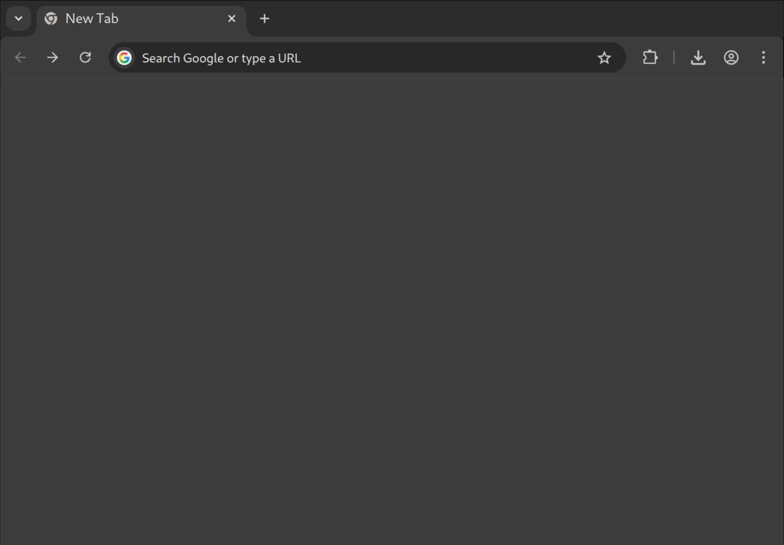

# Blank New Tab

Yet another new tab emblankener. For some reason you need to write an extension to do this, smh. Looks exactly like the default dark-mode new tab sans Google.

# Install

Grab [`blank-new-tab.crx`](https://github.com/milkey-mouse/blank-new-tab/releases/latest/download/blank-new-tab.crx). Failing that, clone or [download](https://github.com/milkey-mouse/blank-new-tab/archive/refs/heads/master.zip) this repo and load the `blank-new-tab` directory (the one containing `manifest.json`) as an [unpacked extension](https://developer.chrome.com/docs/extensions/get-started/tutorial/hello-world#load-unpacked).

# Release

To cut a new release:

- Bump version in `blank-new-tab/manifest.json`
- `git commit`
- `git tag`
- `git push && git push --tags`
- `chromium --pack-extension=blank-new-tab --pack-extension-key=blank-new-tab.pem`
- Upload `blank-new-tab.crx` to latest release on GitHub

We have CI at home.

# License

CC0-1.0/public domain for everything of mine; favicon taken from Chromium project, see [assets/README.md](assets/README.md).
